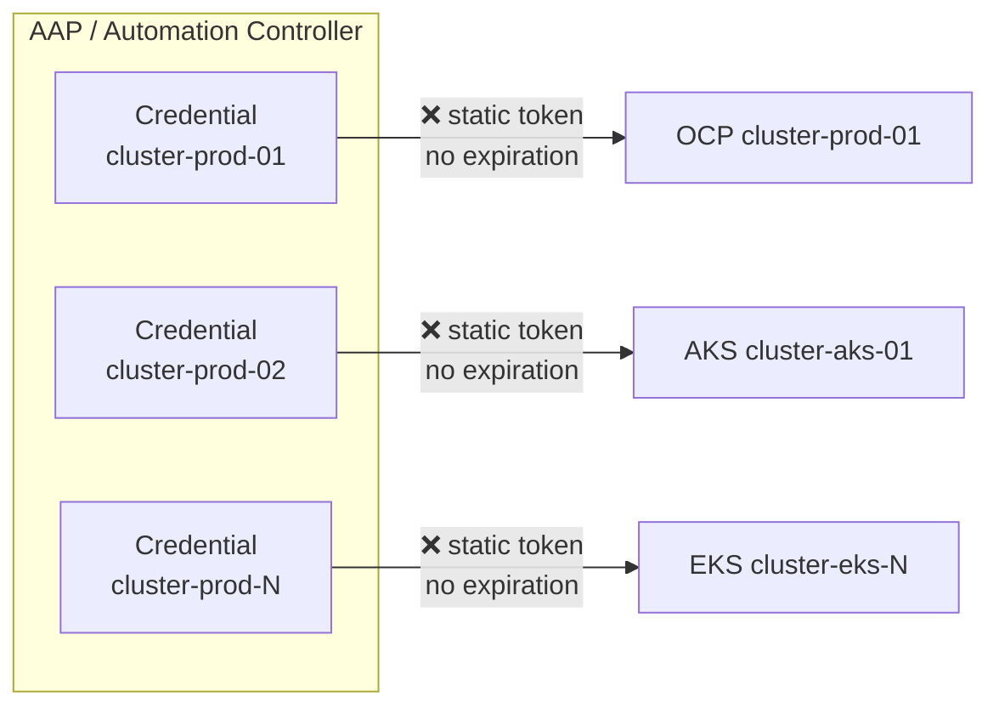
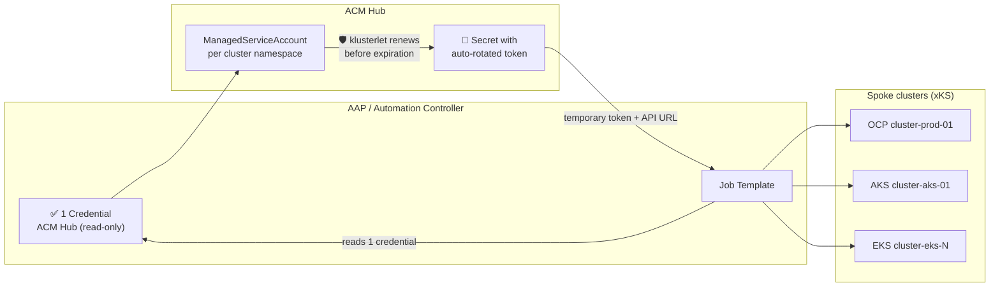
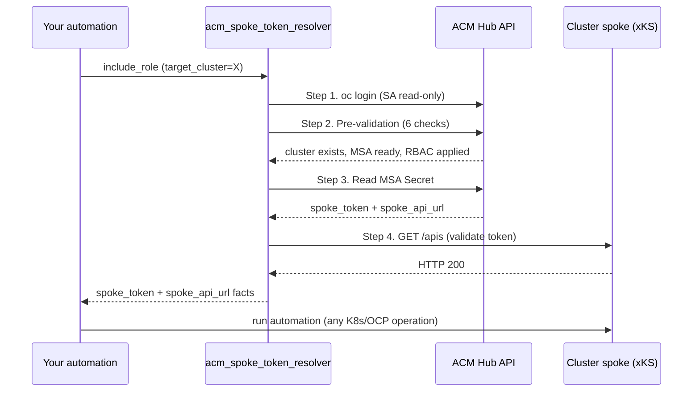

# 🔐 dfmateus.acm_spoke

Ansible collection for centralized access management to spoke/managed clusters registered in a Red Hat Advanced Cluster Management (RHACM) Hub, using the [ManagedServiceAccount](https://docs.redhat.com/en/documentation/red_hat_advanced_cluster_management_for_kubernetes/2.17/html/clusters/index#managed-serviceaccount) API. A single **`read-only`** credential on the Hub replaces all static per-cluster credentials. Tokens are temporary, auto-rotated by the klusterlet, and work with **any Kubernetes distribution**: OpenShift, AKS, EKS, GKE, IKS, ROSA, ARO, or vanilla Kubernetes, as long as the cluster is imported as a ManagedCluster with an active klusterlet.

> 🛡️ **Key outcome:** N static credentials with permanent tokens -> **1 `read-only` credential** with temporary auto-rotated tokens. Onboarding from 15 min/cluster -> under 1 min. Manual rotation -> automatic. Per-cluster revocation -> centralized on the Hub.

## 📦 Installation

```bash
ansible-galaxy collection install dfmateus.acm_spoke
```

### Requirements

- Ansible >= 2.16
- Collection `kubernetes.core` >= 3.0.0
- `oc` CLI (OpenShift client) available in the Execution Environment
- Red Hat Advanced Cluster Management (RHACM) 2.10+ on the Hub cluster

## ⚡ Quick start

**Step 1 — Install the collection:**

```bash
ansible-galaxy collection install dfmateus.acm_spoke
```

**Step 2 — Configure RBAC on the Hub** (**`cluster-admin`**, once per Hub):

Create the `.local/hub_vars_full.yml` file with the connection variables (see [Prepare variables file](docs/usage.md#-prepare-the-variables-file) for details):

```bash
ansible-playbook dfmateus.acm_spoke.setup_hub_rbac \
  -e @.local/hub_vars_full.yml
```

Creates the **`acm-spoke-provisioner`** and **`acm-spoke-reader`** ServiceAccounts with **`least-privilege`** RBAC on the Hub.

**Step 3 — Onboard a spoke cluster** (SA **`acm-spoke-provisioner`**, once per cluster):

```bash
ansible-playbook dfmateus.acm_spoke.setup_spoke_cluster \
  -e @.local/hub_vars_admin.yml \
  -e target_cluster=my-spoke-cluster
```

**Step 4 — Resolve spoke access** (SA **`acm-spoke-reader`**, on every run):

```bash
ansible-playbook dfmateus.acm_spoke.resolve_spoke_access \
  -e @.local/hub_vars_readonly.yml \
  -e target_cluster=my-spoke-cluster
```

**Step 5 — Use the output facts** in your automation:

```yaml
- name: "List nodes on the spoke"
  kubernetes.core.k8s_info:
    api_key: "{{ acm_spoke_token_resolver_spoke_token }}"
    host: "{{ acm_spoke_token_resolver_spoke_api_url }}"
    validate_certs: "{{ acm_spoke_token_resolver_spoke_validate_certs }}"
    kind: Node
  no_log: true
```

## 💡 Why this collection exists

### ❌ The problem: credential sprawl and security exposure

In multi-cluster environments managed by ACM, every automation that connects to a spoke cluster needs its own static credential. This creates operational and security risks that grow proportionally with the number of clusters:



**⚠️ Security risks of the traditional model:**

| Risk                         | Impact                                                                                                                                                                                   |
| ---------------------------- | ---------------------------------------------------------------------------------------------------------------------------------------------------------------------------------------- |
| ❌ Tokens that never expire  | A leaked ServiceAccount token grants permanent access to the cluster until someone discovers the leak and revokes it manually. There is no automatic expiration.                         |
| ❌ Full blast radius         | Each static token is typically bound to the**`cluster-admin`** ClusterRole. If one leaks, the attacker controls the entire cluster: pods, secrets, RBAC, workloads.              |
| ❌ No centralized revocation | To revoke access, you must log into each spoke individually, find the ServiceAccount, delete the token, and confirm no automation broke. At scale, this process is slow and error-prone. |
| ❌ Credential sprawl         | N clusters = N credentials in AAP, N ServiceAccounts on the spokes, N secrets to rotate. Each one is an attack surface.                                                                  |
| ❌ No audit trail            | Token creation, extraction, and rotation are manual processes with no centralized logging. There is no record of who created which token, when, or why.                                  |

**⚠️ Operational risks:**

| Risk                             | Impact                                                                                                                                                                                                            |
| -------------------------------- | ----------------------------------------------------------------------------------------------------------------------------------------------------------------------------------------------------------------- |
| ❌ Manual per-cluster onboarding | Each new spoke requires: logging into the cluster, creating a ServiceAccount, extracting the token, registering the credential in AAP. 10 to 15 minutes per cluster, entirely manual.                             |
| ❌ No pre-validation             | Traditional automation connects to the spoke and hopes the credential works. If the token expired, the SA was deleted, or the RBAC changed, the automation fails mid-execution with a generic error message.      |
| ❌ Impractical rotation          | Rotating N static tokens across N clusters and updating N credentials in AAP is a maintenance burden most teams never perform. The tokens remain valid indefinitely.                                              |
| ❌ Multi-cloud complexity        | In mixed fleets (OpenShift + AKS + EKS + GKE), each platform has different ServiceAccount semantics, API ports, and authentication flows. Maintaining credentials across all of them multiplies operational cost. |

> ⚠️ **Critical risk:** In a fleet with 50 clusters, that is 50 permanent tokens with **`cluster-admin`**, 50 credentials in AAP, 50 attack surfaces. A single leaked token grants unrestricted access to the entire cluster, with no expiration, until someone discovers it and revokes it manually.

### ✅ The solution: centralized token resolution via ACM Hub

This collection eliminates all the problems above by using the ACM Hub as a single point of credential management:



## 📊 Security and operations comparison

| Risk / Aspect                            | ❌ Without this collection (static tokens)                                       | ✅ With acm_spoke_token_resolver                                                       |
| ---------------------------------------- | -------------------------------------------------------------------------------- | -------------------------------------------------------------------------------------- |
| 🔑**Token lifetime**               | Permanent, never expires                                                         | Temporary (default: 30 days), auto-rotated by the klusterlet before expiration         |
| 💥**Blast radius on leak**         | Full cluster access, permanent, until manual revocation                          | Token expires automatically; immediate revocation by deleting the MSA CR on the Hub    |
| 🔧**Number of credentials in AAP** | 1 per cluster (N credentials to manage)                                          | 1 credential (SA**`read-only`** on the Hub) covers all spokes                  |
| ⚡**New cluster onboarding**       | Log into the spoke, create SA, extract token, register in AAP (10-15 min manual) | 2 CRs on the Hub, automated via role`acm_spoke_token_setup` (under 1 min)            |
| 🔄**Credential rotation**          | Manual: log into each spoke, recreate token, update credential in AAP            | Automatic: klusterlet renews the token before TTL expiration                           |
| 🗑️**Access revocation**          | Log into each spoke individually, find and delete SA + token                     | Delete the MSA CR on the Hub. The klusterlet removes the SA on the spoke automatically |
| 📋**Centralized audit**            | None: token creation/rotation is manual with no logging                          | All MSA operations are Kubernetes API events on the Hub, auditable                     |
| 🔎**Pre-validation**               | None: fails mid-execution with generic errors                                    | 6 pre-execution checks before any interaction with the spoke                           |
| ☁️**Multi-cloud support**        | SA with different semantics per platform (OCP, AKS, EKS, GKE)                    | Identical flow for all platforms. MSA is an ACM primitive                              |
| 📈**Scalability**                  | Cost grows linearly: N clusters = N credentials = N rotation cycles              | Fixed cost: 1 credential on the Hub, N MSA CRs (declarative, no rotation overhead)     |

> ✅ **Result:** The same fleet of 50 clusters now operates with **1 `read-only` credential**, tokens with a 30-day validity that renew themselves, and revocation through a single command from the Hub.

## 🏗️ Project structure

The project contains three roles with distinct responsibilities and permissions:

| Role                         | Responsibility                               | SA on the Hub                                            | Frequency        |
| ---------------------------- | -------------------------------------------- | -------------------------------------------------------- | ---------------- |
| `acm_spoke_hub_rbac_setup` | Provision SAs and RBAC on the ACM Hub        | **`cluster-admin`** (bootstrap)                  | Once per Hub     |
| `acm_spoke_token_setup`    | Provision MSA + ManifestWork RBAC on the Hub | **`acm-spoke-provisioner`** (write)              | Once per cluster |
| `acm_spoke_token_resolver` | Read MSA token and validate spoke access     | **`acm-spoke-reader`** (**`read-only`**) | On every run     |

The **`read-only`** SA (**`acm-spoke-reader`**) is the one registered as a credential in AAP for daily operations. The **`acm-spoke-provisioner`** is used only during new cluster onboarding and can be removed from AAP after setup.

The RBAC manifests for both SAs are in [examples/rbac/](examples/rbac/).

```
├── roles/
│   ├── acm_spoke_hub_rbac_setup/         # Hub bootstrap role (cluster-admin)
│   │   ├── defaults/main.yml             # Variables prefixed acm_spoke_hub_rbac_setup_*
│   │   ├── tasks/
│   │   │   ├── main.yml                  # Creates SAs, ClusterRoles, ClusterRoleBindings
│   │   │   └── 1-hub_login.yml           # Hub authentication
│   │   └── meta/main.yml
│   ├── acm_spoke_token_resolver/         # Read-only role
│   │   ├── defaults/main.yml             # Variables prefixed acm_spoke_token_resolver_*
│   │   ├── tasks/
│   │   │   ├── main.yml                  # Entry point (block/rescue, 4 stages)
│   │   │   ├── 1-hub_login.yml           # Hub authentication
│   │   │   ├── 2-preflight.yml           # 6 pre-execution checks
│   │   │   ├── 3-read_msa_secret.yml     # Reads spoke token + API URL
│   │   │   └── 4-validate.yml            # Tests connectivity (GET /apis)
│   │   └── meta/main.yml
│   └── acm_spoke_token_setup/            # Write role (provisioning)
│       ├── defaults/main.yml             # Variables prefixed acm_spoke_token_setup_*
│       ├── tasks/
│       │   ├── main.yml                  # Entry point (block/rescue, steps S.1-S.5)
│       │   └── 1-hub_login.yml           # Hub authentication
│       └── meta/main.yml
├── playbooks/
│   ├── bootstrap_hub_spoke.yml           # Full bootstrap: Hub RBAC + spoke setup
│   ├── resolve_spoke_access.yml          # Resolver wrapper
│   ├── setup_hub_rbac.yml                # Hub RBAC setup wrapper
│   └── setup_spoke_cluster.yml           # Spoke setup wrapper (single + multi-cluster)
├── examples/
│   ├── aap/                              # AAP CaC definitions (import via infra.controller_configuration)
│   │   ├── credential_types/             # 3 Credential Types (bootstrap, resolver, setup)
│   │   ├── job_templates/                # 4 Job Templates (bootstrap, resolver, setup, hub rbac)
│   │   ├── inventories/                  # Localhost inventory
│   │   └── projects/                     # Project definition
│   ├── config/                           # ansible.cfg, navigator, env-setup
│   ├── ee/                               # Execution Environment definition
│   └── rbac/                             # SA RBAC manifests (reader + provisioner)
└── docs/
    ├── value-proposition.md              # Value proposition (executive view, no code)
    ├── setup-guide.md                    # Setup guide (prerequisites, SAs, firewall)
    ├── usage.md                          # Usage examples and AAP integration
    ├── architecture.md                   # Data flow, diagram, port matrix
    └── e2e-validation-matrix.md          # E2E test results
```

## ⚙️ How it works



The role registers three facts as output:

| Output fact                                       | Description                                                                                 |
| ------------------------------------------------- | ------------------------------------------------------------------------------------------- |
| `acm_spoke_token_resolver_spoke_token`          | Temporary bearer token for the spoke cluster                                                |
| `acm_spoke_token_resolver_spoke_api_url`        | Spoke cluster API URL (any platform)                                                        |
| `acm_spoke_token_resolver_spoke_validate_certs` | Resolved TLS validation setting (bool) for use with`kubernetes.core` modules on the spoke |

The consuming automation uses these facts directly. What the downstream automation does with the token is outside the scope of this role.

## 🛡️ RBAC: 3 layered SAs

The collection uses three ServiceAccounts in distinct layers. The SA registered in AAP for daily operations (**`acm-spoke-reader`**) lives on the Hub and is **`read-only`**. The SA that holds permissions on the spoke is a different one (**`acm-spoke-automation`**), created by the klusterlet:

| SA                                     | Where it lives | Permissions                                                                                   | Purpose                                         |
| -------------------------------------- | -------------- | --------------------------------------------------------------------------------------------- | ----------------------------------------------- |
| 🔧**`acm-spoke-provisioner`**  | Hub            | Write on the Hub (create MSA, ManifestWork, addon)                                            | Setup, once per cluster                         |
| 🔎**`acm-spoke-reader`**       | Hub            | **`Read-only`**: 5 resource types on the Hub. **No permissions on the spokes.** | Daily operations (AAP credential)               |
| 🛡️**`acm-spoke-automation`** | Spoke          | **`cluster-admin`** on the spoke (configurable)                                       | Temporary token, auto-rotated by the klusterlet |

The **`acm-spoke-reader`** reads the MSA Secret on the Hub. Inside that Secret is the **`acm-spoke-automation`** token, which is the SA that holds actual permissions on the spoke. The automation uses that token to operate on the target cluster.

**Reader permissions on the Hub (5 resources, `read-only`):**

| Resource                  | Permission | Reason                                                                                  |
| ------------------------- | ---------- | --------------------------------------------------------------------------------------- |
| `ManagedCluster`        | get, list  | Check whether the cluster exists and is Available                                       |
| `ManagedClusterAddOn`   | get        | Check whether the MSA addon is enabled                                                  |
| `ManagedServiceAccount` | get        | Check whether the MSA CR exists                                                         |
| `Secret`                | get        | Read the**`acm-spoke-automation`** token (only in the target cluster namespace) |
| `ManifestWork`          | get        | Check whether RBAC has been applied on the spoke                                        |

> 🔎 **Why is the reader `read-only` if the spoke token has `cluster-admin`?** They are separate SAs in different clusters. The reader lives on the Hub and only reads. The **`acm-spoke-automation`** lives on the spoke and holds the actual permissions. If the reader token leaks, the attacker can read existing spoke tokens but cannot create new ones, modify RBAC, or escalate privileges. The spoke tokens it can read expire automatically via the TTL.

> 🛡️ **Least privilege on the spoke:** the **`acm-spoke-automation`** receives **`cluster-admin`** by default, but this is configurable via the `acm_spoke_token_setup_spoke_cluster_role` variable. If the downstream automation only needs **`view`** or **`edit`**, adjust it during onboarding.

## 🔎 Pre-execution checks

The role validates the entire chain before touching any spoke credential. Each failure message includes the exact `oc` command to diagnose or fix the problem:

| #      | What it validates                       | On failure                                                                       |
| ------ | --------------------------------------- | -------------------------------------------------------------------------------- |
| 🔎 2.1 | ManagedCluster exists on the Hub        | "Cluster X is not managed by this Hub"                                           |
| 🔎 2.2 | ManagedCluster is Available             | "Cluster X is offline or the klusterlet is degraded"                             |
| 🔎 2.3 | managed-serviceaccount addon is enabled | "MSA addon not enabled, shows how to enable it"                                  |
| 🔎 2.4 | ManagedServiceAccount CR exists         | "MSA CR not found, shows how to create it or use the acm_spoke_token_setup role" |
| 🔎 2.5 | MSA Secret exists (token reported)      | "The klusterlet has not yet reported the token"                                  |
| 🔎 2.6 | ManifestWork RBAC exists and is Applied | "RBAC not deployed, SA has no permissions on the spoke"                          |

> ❌ **Without this collection:** the automation connects to the spoke and hopes the credential works. If the token expired, the SA was deleted, or the RBAC changed, the execution fails mid-process with a generic authentication error.
>
> ✅ **With this collection:** the 6 checks detect the problem before any interaction, with an actionable message and a diagnostic command.

## 📋 Prerequisites

Before the role can resolve tokens, each spoke cluster needs two Custom Resources on the Hub: a **ManagedServiceAccount** (instructs the klusterlet to create an SA + token on the spoke) and a **ManifestWork** (deploys a ClusterRoleBinding on the spoke via the Hub).

The `acm_spoke_token_setup` role creates these CRs automatically. For manual setup, see sections 2.1 and 2.2 of the [setup guide](docs/setup-guide.md).

## ☁️ Supported platforms (xKS)

The role works with any Kubernetes distribution imported as a ManagedCluster on the ACM Hub. The MSA API and ManifestWork are ACM primitives that operate through the klusterlet, with no dependency on OpenShift APIs on the spoke.

| Platform                                | vendor label   | API port | Support                          |
| --------------------------------------- | -------------- | -------- | -------------------------------- |
| OpenShift Container Platform (OCP)      | `OpenShift`  | 6443     | ✅ Full                          |
| Azure Red Hat OpenShift (ARO Classic)   | `OpenShift`  | 6443     | ✅ Full                          |
| Azure Red Hat OpenShift (ARO HCP)       | `OpenShift`  | 443      | ✅ Full                          |
| ROSA / ROSA HCP                         | `OpenShift`  | 6443     | ✅ Full                          |
| Azure Kubernetes Service (AKS)          | `Kubernetes` | 443      | ✅ Full                          |
| Amazon Elastic Kubernetes Service (EKS) | `Kubernetes` | 443      | ✅ Full                          |
| Google Kubernetes Engine (GKE)          | `Kubernetes` | 443      | ✅ Full                          |
| IBM Kubernetes Service (IKS)            | `Kubernetes` | 443      | ✅ Full                          |
| Vanilla Kubernetes                      | `Kubernetes` | varies   | ✅ Full (with active klusterlet) |

> 🔎 **TLS auto-detection:** The `vendor` label (`OpenShift` or `Kubernetes`) is assigned by RHACM during import. The role reads this label to auto-detect TLS validation: `OpenShift` -> `validate_certs: true` (public CAs), `Kubernetes` -> `validate_certs: false` (internal CAs). No manual per-platform configuration needed.

## 🔧 Variables

### Role `acm_spoke_hub_rbac_setup` (Hub bootstrap)

| Variable                                                   | Required | Default                           | Description                                                                                                                        |
| ---------------------------------------------------------- | -------- | --------------------------------- | ---------------------------------------------------------------------------------------------------------------------------------- |
| `acm_spoke_hub_rbac_setup_hub_url`                       | Yes      | `""`                            | ACM Hub API URL                                                                                                                    |
| `acm_spoke_hub_rbac_setup_hub_token`                     | Yes      | `""`                            | Bearer token from a user with**`cluster-admin`** on the Hub                                                                |
| `acm_spoke_hub_rbac_setup_validate_certs`                | No       | `true`                          | Validate TLS certificates when connecting to the Hub API                                                                           |
| `acm_spoke_hub_rbac_setup_namespace`                     | No       | `"open-cluster-management"`     | Namespace where the SAs will be created                                                                                            |
| `acm_spoke_hub_rbac_setup_provisioner_sa_name`           | No       | `"acm-spoke-provisioner"`       | Name of the write SA used by`acm_spoke_token_setup`                                                                              |
| `acm_spoke_hub_rbac_setup_provisioner_clusterrole_name`  | No       | `"acm-spoke-provisioner"`       | Name of the write ClusterRole                                                                                                      |
| `acm_spoke_hub_rbac_setup_provisioner_token_secret_name` | No       | `"acm-spoke-provisioner-token"` | Name of the provisioner long-lived token Secret                                                                                    |
| `acm_spoke_hub_rbac_setup_reader_sa_name`                | No       | `"acm-spoke-reader"`            | Name of the**`read-only`** SA used by `acm_spoke_token_resolver`                                                         |
| `acm_spoke_hub_rbac_setup_reader_clusterrole_name`       | No       | `"acm-spoke-reader"`            | Name of the**`read-only`** ClusterRole                                                                                     |
| `acm_spoke_hub_rbac_setup_reader_token_secret_name`      | No       | `"acm-spoke-reader-token"`      | Name of the reader long-lived token Secret                                                                                         |
| `acm_spoke_hub_rbac_setup_msa_secret_name`               | No       | `"acm-spoke-automation"`        | Name of the MSA Secret the reader can access. Must match`acm_spoke_token_resolver_msa_name` / `acm_spoke_token_setup_msa_name` |
| `acm_spoke_hub_rbac_setup_no_log`                        | No       | `true`                          | Mask sensitive data (tokens) in job output                                                                                         |

### Role `acm_spoke_token_resolver` (read)

| Variable                                          | Required | Default                         | Description                                                                                                                                                         |
| ------------------------------------------------- | -------- | ------------------------------- | ------------------------------------------------------------------------------------------------------------------------------------------------------------------- |
| `acm_spoke_token_resolver_hub_url`              | Yes      | `""`                          | ACM Hub API URL                                                                                                                                                     |
| `acm_spoke_token_resolver_hub_token`            | Yes      | `""`                          | Bearer token from the**`read-only`** SA on the Hub                                                                                                          |
| `acm_spoke_token_resolver_target_cluster`       | Yes      | `""`                          | ManagedCluster name on the Hub                                                                                                                                      |
| `acm_spoke_token_resolver_validate_certs`       | No       | `true`                        | Validate TLS certificates when connecting to the Hub API                                                                                                            |
| `acm_spoke_token_resolver_spoke_validate_certs` | No       | `"auto"`                      | TLS validation for the spoke.`"auto"` detects via the ManagedCluster `vendor` label (OpenShift=true, others=false). Accepts override with `true` or `false` |
| `acm_spoke_token_resolver_msa_name`             | No       | `"acm-spoke-automation"`      | Name of the MSA CR on the Hub                                                                                                                                       |
| `acm_spoke_token_resolver_manifestwork_name`    | No       | `"acm-spoke-automation-rbac"` | Name of the ManifestWork CR                                                                                                                                         |
| `acm_spoke_token_resolver_no_log`               | No       | `true`                        | Mask tokens in job output                                                                                                                                           |

**Output facts:**

| Fact                                              | Description                                                                                 |
| ------------------------------------------------- | ------------------------------------------------------------------------------------------- |
| `acm_spoke_token_resolver_spoke_token`          | Temporary bearer token for the spoke                                                        |
| `acm_spoke_token_resolver_spoke_api_url`        | Spoke cluster API URL                                                                       |
| `acm_spoke_token_resolver_spoke_validate_certs` | Resolved TLS validation setting (bool) for use with`kubernetes.core` modules on the spoke |

### Role `acm_spoke_token_setup` (write)

| Variable                                     | Required | Default                         | Description                                                            |
| -------------------------------------------- | -------- | ------------------------------- | ---------------------------------------------------------------------- |
| `acm_spoke_token_setup_hub_url`            | Yes      | `""`                          | ACM Hub API URL                                                        |
| `acm_spoke_token_setup_hub_token`          | Yes      | `""`                          | Bearer token from the**`acm-spoke-provisioner`** SA on the Hub |
| `acm_spoke_token_setup_target_cluster`     | Yes      | `""`                          | ManagedCluster name on the Hub                                         |
| `acm_spoke_token_setup_validate_certs`     | No       | `true`                        | Validate TLS certificates for the Hub                                  |
| `acm_spoke_token_setup_msa_name`           | No       | `"acm-spoke-automation"`      | Name of the MSA CR to create                                           |
| `acm_spoke_token_setup_manifestwork_name`  | No       | `"acm-spoke-automation-rbac"` | Name of the ManifestWork to create                                     |
| `acm_spoke_token_setup_spoke_cluster_role` | No       | `"cluster-admin"`             | ClusterRole bound on the spoke                                         |
| `acm_spoke_token_setup_msa_validity`       | No       | `"720h"`                      | MSA token TTL                                                          |
| `acm_spoke_token_setup_no_log`             | No       | `true`                        | Mask tokens in job output                                              |

## ▶️ Usage examples

### Example 1: Resolve access to a spoke (any platform)

Any automation that needs a spoke token, regardless of the cluster platform, can use the role directly:

```yaml
---
- name: "Run automation against a spoke cluster"
  hosts: localhost
  connection: local
  gather_facts: false
  tasks:
    - name: "Resolve spoke access via ACM Hub"
      ansible.builtin.include_role:
        name: dfmateus.acm_spoke.acm_spoke_token_resolver
      vars:
        acm_spoke_token_resolver_target_cluster: "{{ target_cluster }}"

    # Output facts available for any downstream task:
    #   acm_spoke_token_resolver_spoke_token
    #   acm_spoke_token_resolver_spoke_api_url
    #   acm_spoke_token_resolver_spoke_validate_certs

    - name: "List nodes on the spoke (OCP, AKS, EKS, GKE, etc.)"
      kubernetes.core.k8s_info:
        api_key: "{{ acm_spoke_token_resolver_spoke_token }}"
        host: "{{ acm_spoke_token_resolver_spoke_api_url }}"
        validate_certs: "{{ acm_spoke_token_resolver_spoke_validate_certs }}"
        kind: Node
      no_log: true
```

### Example 2: Multi-cluster loop

Resolve access to multiple spokes in a single run:

```yaml
---
- name: "Health check across all spoke clusters"
  hosts: localhost
  connection: local
  gather_facts: false
  tasks:
    - name: "Resolve and check each cluster"
      ansible.builtin.include_tasks: check_cluster.yml
      loop:
        - cluster-ocp-prod-01
        - cluster-aks-prod-01
        - cluster-eks-staging-01
      loop_control:
        loop_var: __cluster

# check_cluster.yml
# - name: "Resolve access"
#   ansible.builtin.include_role:
#     name: dfmateus.acm_spoke.acm_spoke_token_resolver
#   vars:
#     acm_spoke_token_resolver_target_cluster: "{{ __cluster }}"
#
# - name: "Check cluster health"
#   kubernetes.core.k8s_info:
#     api_key: "{{ acm_spoke_token_resolver_spoke_token }}"
#     host: "{{ acm_spoke_token_resolver_spoke_api_url }}"
#     validate_certs: "{{ acm_spoke_token_resolver_spoke_validate_certs }}"
#     kind: Node
```

### Example 3: New cluster setup

Automatically create the MSA CR and the ManifestWork RBAC on the Hub using the `acm_spoke_token_setup` role. Requires the **`acm-spoke-provisioner`** SA (write):

```shell
# Single cluster (OpenShift, AKS, EKS, GKE, any ManagedCluster)
ansible-playbook playbooks/setup_spoke_cluster.yml \
  -e @.local/hub_vars_admin.yml \
  -e target_cluster=my-new-cluster

# Multiple clusters at once
ansible-playbook playbooks/setup_spoke_cluster.yml \
  -e @.local/hub_vars_admin.yml \
  -e '{"target_clusters": ["ocp-prod-01", "aks-prod-01", "eks-staging-01"]}'
```

### Example 4: Setup from your own playbook

Include the setup role directly:

```yaml
---
- name: "Onboard spoke clusters for token resolution via ACM"
  hosts: localhost
  connection: local
  gather_facts: false
  tasks:
    - name: "Setup each cluster"
      ansible.builtin.include_role:
        name: dfmateus.acm_spoke.acm_spoke_token_setup
      loop:
        - ocp-prod-01
        - aks-prod-01
        - eks-staging-01
      loop_control:
        loop_var: __setup_cluster_name
      vars:
        acm_spoke_token_setup_target_cluster: "{{ __setup_cluster_name }}"
```

## 🎯 Use cases

This collection is a generic credential resolver for spoke clusters. Any automation that needs to connect to a managed cluster can use it. The role resolves the token and delivers the facts; what the downstream automation does with them is its own concern.

| Area                         | Concrete example                                                                       |
| ---------------------------- | -------------------------------------------------------------------------------------- |
| 🔎 Diagnostics               | Resolve the spoke token and run`oc adm must-gather`, log collection, node inspection |
| 🛡️ Compliance and security | Run CIS benchmarks, security scans, audit reports against any spoke                    |
| 🔧 Day-2 operations          | Certificate rotation, backup, node draining, fleet-wide configuration updates          |
| 💥 Disaster recovery         | Failover/failback between Hubs, RBAC sync, cross-cluster connectivity validation       |
| 🚀 Deployment                | Application rollouts, any`kubectl` or `oc` operation against any managed spoke     |

## 📖 Documentation

Each document targets a specific need and audience. Pick the entry point that matches your goal:

| If you need to...                                            | Document                                                | What you will find                                                                                                                      |
| ------------------------------------------------------------ | ------------------------------------------------------- | --------------------------------------------------------------------------------------------------------------------------------------- |
| Present the value to managers, CISO, or stakeholders         | 🔐[Value proposition](docs/value-proposition.md)         | Executive view with diagrams, impact metrics, before/after scenarios, and the 3-layered SA model. No code.                              |
| Understand the data flow, SA model, and network requirements | 🏗️[Architecture](docs/architecture.md)                 | End-to-end diagram, 3-SA access chain, TLS auto-detection, port matrix per platform, and firewall rules.                                |
| Set up the environment from scratch (Hub, spokes, AAP)       | 📋[Setup guide](docs/setup-guide.md)                     | Step-by-step per phase: enable MSA addon, create SAs and RBAC, firewall, EE build, spoke onboarding, verification, and checklist.       |
| Run the roles via CLI or integrate with AAP                  | ▶️[Usage examples](docs/usage.md)                      | 6 CLI examples, 3 Credential Types, 3 Job Templates, surveys, Workflow Templates with`set_stats`, and troubleshooting.                |
| See real test results in an RHACM environment                | 🧪[E2E validation matrix](docs/e2e-validation-matrix.md) | 16 tests on RHACM 2.12 with AKS, ARO Classic, and ARO HCP: setup, resolver, AAP bootstrap, negative tests, and must-gather integration. |

## 📄 License

GPL-3.0-or-later

## 👤 Author

Diego Felipe Mateus
