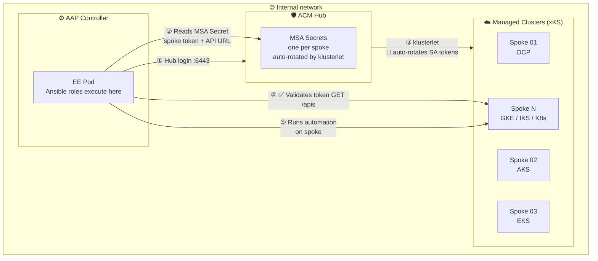
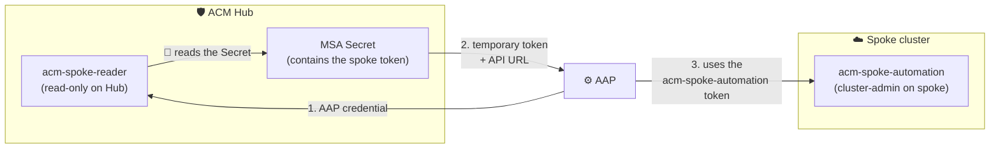

# 🏗️ Architecture: dfmateus.acm_spoke

## 🔄 End-to-end data flow



| Step | Actor      | Action                                                                                                                                        |
| ---- | ---------- | --------------------------------------------------------------------------------------------------------------------------------------------- |
| ①   | AAP EE     | **`oc login`** to the ACM Hub using the Hub SA credential                                                                                     |
| ②   | AAP EE     | Reads the MSA Secret in the spoke namespace on the Hub; resolves **`spoke_token`** + **`spoke_api_url`** as Ansible facts                     |
| ③ 🔄 | klusterlet | Runs continuously: creates the SA on the spoke, issues a **`TokenRequest`** with TTL, reports the token back to the Hub Secret, renews before expiration |
| ④ ✅ | AAP EE     | Validates the resolved token with **`GET /apis`** on the spoke (HTTP 200 = success)                                                           |
| ⑤   | AAP EE     | Runs any downstream automation on the spoke using the resolved facts                                                                          |

## 🛡️ Why MSA instead of infinite tokens

### ❌ Problem

Manual creation of **`kubernetes.io/service-account-token`** Secrets on each managed cluster. Each cluster gets a ServiceAccount with a bearer token that never expires. In fleets with dozens or hundreds of clusters, this creates credential sprawl with unlimited blast radius if any token leaks.

### ✅ Solution

Use the RHACM **[ManagedServiceAccount](https://docs.redhat.com/en/documentation/red_hat_advanced_cluster_management_for_kubernetes/2.17/html/clusters/index#managed-serviceaccount)** (MSA) API (**`authentication.open-cluster-management.io/v1beta1`**) to centralize ServiceAccount lifecycle management on the ACM Hub.

### ⚙️ How MSA works

1. The administrator creates a `ManagedServiceAccount` CR on the ACM Hub, in the managed cluster namespace
2. The klusterlet on the spoke provisions the SA automatically
3. The klusterlet creates a `TokenRequest` (with limited TTL) and reports the credentials back to the Hub
4. The Hub stores the credentials as a `Secret` in the same namespace
5. When the credentials approach expiration, the klusterlet renews them automatically

> 🛡️ **Security:** the entire token lifecycle is managed by the klusterlet. No long-lived credentials are stored on the spoke. The token expires automatically and is renewed without manual intervention.

### 🔎 Comparison table

| Aspect                            | SA + infinite credentials               | ACM MSA                                         |
| --------------------------------- | --------------------------------------- | ----------------------------------------------- |
| Credential lifetime               | ❌ Infinite (never expires)             | ✅ Configurable TTL with auto-rotation          |
| Per-cluster setup                  | ❌ Manual on each cluster               | ✅ One MSA CR on the Hub                        |
| Blast radius on leak               | ❌ Full cluster access, forever         | ✅ Limited by TTL, expires automatically        |
| Audit trail                        | ❌ Manual tracking                      | ✅ ACM records MSA status and conditions        |
| Scalability for N clusters         | ❌ Linear manual effort                 | ✅ One ManifestWork template per cluster        |
| Revocation                         | ❌ Manual deletion per cluster          | ✅ Delete MSA on Hub; klusterlet cleans the spoke |
| Requires ACM                       | ✅ No                                   | ⚠️ Yes                                         |

### 🧩 Architectural boundary

The project contains three roles with distinct responsibilities:

| Role                         | Responsibility                                     | Required SA                                      | Frequency              |
| ---------------------------- | -------------------------------------------------- | ------------------------------------------------ | ---------------------- |
| `acm_spoke_hub_rbac_setup` | Create SAs, RBAC on Hub + discover ManagedClusters | **`cluster-admin`** (setup)              | 🔄 Once per Hub        |
| `acm_spoke_token_setup`    | Create MSA CR + ManifestWork RBAC per spoke        | **`acm-spoke-provisioner`** (write)      | 🔄 Once per cluster    |
| `acm_spoke_token_resolver` | Read MSA token and validate spoke access           | **`acm-spoke-reader`** (read-only)       | 🔄 Every execution     |

The `acm_spoke_hub_rbac_setup` role prepares the Hub: creates the SAs (**`acm-spoke-provisioner`** and **`acm-spoke-reader`**), their ClusterRoles and ClusterRoleBindings, extracts long-lived tokens, and discovers all registered ManagedClusters (auto-discovery). Runs once per Hub with a **`cluster-admin`** credential.

The `acm_spoke_token_setup` role provisions the MSA infrastructure on the Hub for each spoke: enables the addon, creates the MSA CR and the ManifestWork RBAC. Uses the **`acm-spoke-provisioner`** SA token (created by the previous role). After setup, the provisioner SA can be removed from AAP (it is not needed for day-to-day operations).

The `acm_spoke_token_resolver` role is a generic spoke credential resolver. It receives the target cluster name, authenticates to the Hub with the read-only SA, resolves the MSA token, and delivers three Ansible facts: `spoke_token`, `spoke_api_url`, and `spoke_validate_certs`. What the downstream automation does with these facts is its own responsibility.

> ✅ **Result:** the **`bootstrap_hub_spoke.yml`** playbook orchestrates the three roles in sequence (step 0 -> step 1 loop -> step 2 loop) with auto-discovery. All it needs is a **`cluster-admin`** token and the playbook provisions the entire fleet without manual intervention.

#### 🔑 3 layered SAs

The three roles operate with three distinct ServiceAccounts, each scoped to the minimum required for its function. The point that often causes confusion: the SA registered in AAP for daily operations (**`acm-spoke-reader`**) is **read-only on the Hub**, but the token it reads belongs to a different SA (**`acm-spoke-automation`**) that lives on the spoke and has **`cluster-admin`**.

| SA                                    | Where it lives | Permissions                                                                                                                     | Purpose                                                                                                                          |
| ------------------------------------- | -------------- | ------------------------------------------------------------------------------------------------------------------------------- | -------------------------------------------------------------------------------------------------------------------------------- |
| **`acm-spoke-provisioner`** | Hub            | Write on Hub: create MSA, ManifestWork, enable addon                                                                            | Setup, once per cluster. Can be removed from AAP after onboarding.                                                               |
| **`acm-spoke-reader`**      | Hub            | Read-only on Hub: read 5 resource types. **Has no permissions on the spokes.**                                                  | Daily operation. This is the SA registered as a credential in AAP.                                                               |
| **`acm-spoke-automation`**      | Spoke          | **`cluster-admin`** on the spoke (configurable via **`spoke_cluster_role`**). Created automatically by the klusterlet via MSA.  | Temporary token with TTL (default 30 days), auto-rotated. This is the token that automation actually uses to operate on the spoke. |

The access chain:



> 🔎 **Why is the reader read-only if the spoke token has cluster-admin?** Because they are two distinct SAs in two different clusters. The **`acm-spoke-reader`** lives on the Hub and can only read 5 resource types. The **`acm-spoke-automation`** lives on the spoke and has the actual permissions. This separation ensures that: (1) the AAP credential cannot modify anything on the Hub or on the spokes directly, (2) the spoke token that the reader reads expires automatically by TTL, and (3) if the reader token leaks, the attacker cannot create new tokens or escalate privileges.

> 🛡️ **Least privilege on the spoke:** the **`acm-spoke-automation`** receives **`cluster-admin`** by default, but this is configurable. If the downstream automation only needs **`view`** or **`edit`**, change the **`acm_spoke_token_setup_spoke_cluster_role`** variable during onboarding. The **`ManifestWork`** applies whatever **`ClusterRole`** you define.

### 🔎 Spoke TLS auto-detection

The **`acm_spoke_token_resolver`** role automatically detects whether to validate TLS certificates when connecting to the spoke API. It reads the **`vendor`** label from the **`ManagedCluster`** CR:

- **`vendor: OpenShift`** (ARO, ROSA, OCP) -> **`validate_certs: true`** (public CAs)
- **`vendor: Kubernetes`** (AKS, EKS, GKE) -> **`validate_certs: false`** (internal CAs)

> 🔎 **Auto-detection:** this eliminates the need for manual TLS configuration per spoke or platform. The **`acm_spoke_token_resolver_spoke_validate_certs`** variable accepts **`"auto"`** (default), **`true`** or **`false`** for override.

---

## 🌐 Network requirements

The role operates entirely on the internal network. No internet access is required.

### 📡 Endpoints

| # | Source | Destination                       | Port | Protocol | Purpose                                       |
| - | ------ | --------------------------------- | ---- | -------- | --------------------------------------------- |
| 1 | AAP EE | ACM Hub API                       | 6443 | HTTPS    | **`oc login`** to Hub to read MSA Secrets       |
| 2 | AAP EE | OpenShift spoke APIs              | 6443 | HTTPS    | Token validation + downstream automation      |
| 3 | AAP EE | xKS spoke APIs (AKS, EKS, GKE)   | 443  | HTTPS    | Token validation + downstream automation      |

### 🔌 Ports by platform

| Platform                                | API port | Notes                                        |
| --------------------------------------- | -------- | -------------------------------------------- |
| OpenShift (OCP, ARO Classic, ROSA)      | 6443     | Default kube-apiserver port on OpenShift      |
| ARO HCP (Hosted Control Planes)        | 443      | API via Azure-managed HTTPS endpoint         |
| AKS (Azure Kubernetes Service)          | 443      | API via standard HTTPS load balancer         |
| EKS (Amazon Elastic Kubernetes Service) | 443      | API via NLB/ALB HTTPS                        |
| GKE (Google Kubernetes Engine)          | 443      | API via public or private endpoint           |
| IKS (IBM Kubernetes Service)            | 443      | API via HTTPS endpoint                       |
| Vanilla Kubernetes                      | varies   | Depends on cluster configuration             |

### 🛡️ Firewall rules summary

For the network/security team, add these egress rules from the AAP Controller node (or the node that runs EE pods):

```text
ALLOW  AAP-node  ->  ACM-Hub-API:6443           TCP/HTTPS  (Hub login + MSA read)
ALLOW  AAP-node  ->  Spoke-OCP-APIs:6443         TCP/HTTPS  (validation + OCP automation)
ALLOW  AAP-node  ->  Spoke-xKS-APIs:443          TCP/HTTPS  (validation + AKS/EKS/GKE automation)
```

> ⚠️ **Note:** all traffic stays on the internal network. No internet firewall rules are required for this role. If the downstream automation needs to access external APIs, those firewall rules are the responsibility of the downstream automation, not this role.
