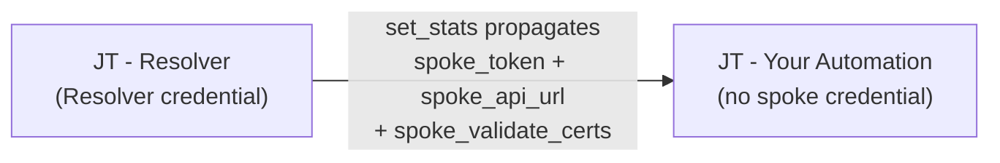
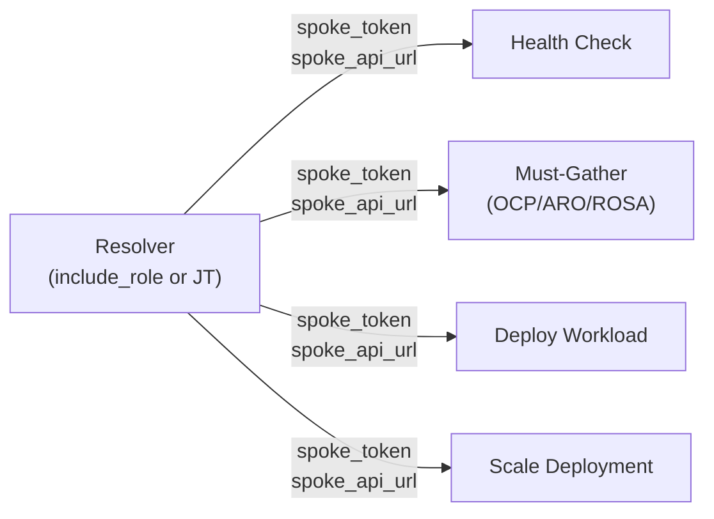

# ▶️ Role usage

How to run the roles via ansible-navigator, ansible-playbook and AAP. Covers execution examples, AAP integration (credential types, JTs, surveys) and troubleshooting.

---

## 📝 Prepare the variables file

Always use a variables file instead of `-e key=value` inline. ansible-navigator passes the command to `bash -c "..."` inside the EE container, and values with spaces are split incorrectly.

Each role uses a separate variables file because the prefixes differ and the SA permissions are distinct:

**`.local/hub_vars_full.yml`** (for bootstrap, cluster-admin):

```yaml
---
acm_spoke_hub_rbac_setup_hub_url: "https://api.hub.example.com:6443"
acm_spoke_hub_rbac_setup_hub_token: "<cluster-admin-token>"
acm_spoke_hub_rbac_setup_validate_certs: true
```

**`.local/hub_vars_readonly.yml`** (for the resolver, read-only SA):

```yaml
---
acm_spoke_token_resolver_hub_url: "https://api.hub.example.com:6443"
acm_spoke_token_resolver_hub_token: "<acm-spoke-reader-sa-token>"
acm_spoke_token_resolver_validate_certs: true
```

**`.local/hub_vars_admin.yml`** (for individual setup, provisioner SA):

```yaml
---
acm_spoke_token_setup_hub_url: "https://api.hub.example.com:6443"
acm_spoke_token_setup_hub_token: "<acm-spoke-provisioner-sa-token>"
acm_spoke_token_setup_validate_certs: true
```

> 🛡️ **Security:** These files contain bearer tokens. Keep them in `.local/` (gitignored) and never commit them. See [examples/rbac/](../examples/rbac/) for the RBAC manifests of each SA.

---

## ▶️ Running via ansible-navigator

### Example 1: Resolve access to a spoke

```bash
ansible-navigator run playbooks/resolve_spoke_access.yml \
  --mode stdout \
  --eei <registry>/acm-spoke-token-resolver-ee:1.0.0 \
  -e @.local/hub_vars_readonly.yml \
  -e target_cluster=aro-prod-eastus-01
```

Expected output: the 4 stages run in sequence (Hub Login, Pre-flight, MSA Read, Validation) and the final summary shows the API URL and access status.

### Example 2: Full bootstrap (recommended)

End-to-end setup: creates SAs + RBAC on the Hub, auto-discovers all ManagedClusters, provisions MSA + ManifestWork on each spoke and validates access. Idempotent.

```bash
# Auto-discovery (processes ALL spokes on the Hub):
ansible-navigator run playbooks/bootstrap_hub_spoke.yml \
  --mode stdout \
  --eei <registry>/acm-spoke-token-resolver-ee:1.0.0 \
  -e @.local/hub_vars_full.yml

# Explicit list (only the specified spokes):
ansible-navigator run playbooks/bootstrap_hub_spoke.yml \
  --mode stdout \
  --eei <registry>/acm-spoke-token-resolver-ee:1.0.0 \
  -e @.local/hub_vars_full.yml \
  -e '{"target_clusters": ["ocp-prod-01", "aks-prod-01"]}'
```

> ⚠️ **Warning:** The bootstrap requires a **cluster-admin** credential on the Hub to create SAs and RBAC (step 0). Spoke TLS is auto-detected via the ManagedCluster `vendor` label. No manual configuration is needed.

### Example 3: Individual cluster setup (without bootstrap)

```bash
ansible-navigator run playbooks/setup_spoke_cluster.yml \
  --mode stdout \
  --eei <registry>/acm-spoke-token-resolver-ee:1.0.0 \
  -e @.local/hub_vars_admin.yml \
  -e target_cluster=eks-staging-01
```

### Example 4: Custom playbook using the role

Create a playbook that resolves the token and runs downstream automation:

```yaml
---
# playbooks/health_check_spoke.yml
- name: "Health check on spoke cluster via ACM"
  hosts: localhost
  connection: local
  gather_facts: false
  tasks:
    - name: "[RESOLVER] | Resolve spoke access"
      ansible.builtin.include_role:
        name: dfmateus.acm_spoke.acm_spoke_token_resolver
      vars:
        acm_spoke_token_resolver_target_cluster: "{{ target_cluster }}"

    - name: "List spoke nodes"
      kubernetes.core.k8s_info:
        api_key: "{{ acm_spoke_token_resolver_spoke_token }}"
        host: "{{ acm_spoke_token_resolver_spoke_api_url }}"
        validate_certs: "{{ acm_spoke_token_resolver_spoke_validate_certs }}"
        kind: Node
      register: __spoke_nodes
      no_log: true

    - name: "Health check summary"
      ansible.builtin.debug:
        msg:
          - "Cluster: {{ target_cluster }}"
          - "Nodes: {{ __spoke_nodes.resources | length }}"
          - "Status: {{ __spoke_nodes.resources | map(attribute='status.conditions')
              | map('selectattr', 'type', 'equalto', 'Ready')
              | map('map', attribute='status') | list }}"
```

Run:

```bash
ansible-navigator run playbooks/health_check_spoke.yml \
  --mode stdout \
  --eei <registry>/acm-spoke-token-resolver-ee:1.0.0 \
  -e @.local/hub_vars_readonly.yml \
  -e target_cluster=aro-prod-eastus-01
```

### Example 5: Multi-cluster loop

```yaml
---
# playbooks/multi_cluster_check.yml
- name: "Health check on multiple spoke clusters"
  hosts: localhost
  connection: local
  gather_facts: false
  vars:
    clusters_to_check:
      - ocp-prod-01
      - aks-prod-01
      - eks-staging-01
  tasks:
    - name: "Resolve and check each cluster"
      ansible.builtin.include_tasks: tasks/check_single_cluster.yml
      loop: "{{ clusters_to_check }}"
      loop_control:
        loop_var: __cluster_name
        label: "{{ __cluster_name }}"
```

```yaml
---
# tasks/check_single_cluster.yml
- name: "[RESOLVER] | Resolve access for {{ __cluster_name }}"
  ansible.builtin.include_role:
    name: dfmateus.acm_spoke.acm_spoke_token_resolver
  vars:
    acm_spoke_token_resolver_target_cluster: "{{ __cluster_name }}"

- name: "Check nodes on {{ __cluster_name }}"
  kubernetes.core.k8s_info:
    api_key: "{{ acm_spoke_token_resolver_spoke_token }}"
    host: "{{ acm_spoke_token_resolver_spoke_api_url }}"
    validate_certs: "{{ acm_spoke_token_resolver_spoke_validate_certs }}"
    kind: Node
  register: __nodes
  no_log: true

- name: "{{ __cluster_name }}: {{ __nodes.resources | length }} nodes"
  ansible.builtin.debug:
    msg: "{{ __cluster_name }} - {{ __nodes.resources | length }} nodes Ready"
```

Run:

```bash
ansible-navigator run playbooks/multi_cluster_check.yml \
  --mode stdout \
  --eei <registry>/acm-spoke-token-resolver-ee:1.0.0 \
  -e @.local/hub_vars_readonly.yml
```

### Example 6: Running with ansible-playbook (without EE)

If the workstation has `oc` and the collections installed locally:

```bash
ansible-playbook playbooks/resolve_spoke_access.yml \
  -e @.local/hub_vars_readonly.yml \
  -e target_cluster=aro-prod-eastus-01
```

> 🔎 **Note:** Without an EE, you depend on `oc` and the collections installed on the workstation. The EE guarantees reproducibility across environments.

---

## 🔧 AAP integration

### Required objects in AAP

| # | Object                   | Type      | Purpose                                                                                                                         |
| - | ------------------------ | --------- | ------------------------------------------------------------------------------------------------------------------------------- |
| 1 | 🔑 Credential Types (x3) | Custom    | Bootstrap (**`cluster-admin`**), Resolver (**`acm-spoke-reader`**), Setup (**`acm-spoke-provisioner`**) |
| 2 | 🔑 Credentials           | Instance  | One credential per type and per environment (LAB, PRD)                                                                          |
| 3 | 📂 Project               | SCM (Git) | Points to the`dfmateus.acm_spoke` repository                                                                                  |
| 4 | 📦 Execution Environment | Custom    | EE with`oc` CLI + `kubernetes.core` collection                                                                              |
| 5 | 📋 Inventory             | Static    | `localhost` with `ansible_connection: local`                                                                                |
| 6 | ▶️ Job Templates (x3)  | Wrapper   | Bootstrap (full setup), Resolver (daily operation), Setup (individual spoke)                                                    |

To avoid manual configuration in the UI, you can import all these objects via Configuration as Code (CaC) using the `infra.controller_configuration` collection. Ready-to-import YAML definitions (3 Credential Types, 4 Job Templates, Inventory and Project) are available in **[`examples/aap/`](../examples/aap/)**.

> 🔑 **3 layered SAs:** each Credential Type injects the token of a different SA. Bootstrap uses **`cluster-admin`** (full Hub and spoke setup). Resolver uses **`acm-spoke-reader`** (read-only on the Hub, daily operation). Setup uses **`acm-spoke-provisioner`** (write access on the Hub, individual spoke). See [architecture.md](architecture.md) for the 3-SA diagram.

### Credential Type: ACM Spoke Bootstrap - Hub

Injects Hub connection variables for the `bootstrap_hub_spoke.yml` playbook. Requires **`cluster-admin`** on the Hub to create SAs, RBAC, MSA CRs and ManifestWorks end-to-end.

**Inputs:**

```json
{
  "fields": [
    {
      "id": "hub_url",
      "type": "string",
      "label": "ACM Hub API URL (Required)",
      "help_text": "Full URL of the ACM Hub API endpoint (e.g., https://api.hub.example.com:6443)."
    },
    {
      "id": "hub_token",
      "type": "string",
      "label": "Hub Bearer Token (Required)",
      "secret": true,
      "help_text": "Token with cluster-admin on the Hub. Creates SAs, RBAC, MSA CRs, and ManifestWorks. Required for initial bootstrap and re-runs to onboard new clusters."
    },
    {
      "id": "validate_certs",
      "type": "boolean",
      "label": "Validate Hub TLS Certificate (Optional)",
      "help_text": "Verify the Hub API server TLS certificate chain. Uncheck only in lab environments with self-signed certificates."
    }
  ],
  "required": ["hub_url", "hub_token"]
}
```

**Injectors:**

```json
{
  "extra_vars": {
    "acm_spoke_hub_rbac_setup_hub_url": "{{ hub_url }}",
    "acm_spoke_hub_rbac_setup_hub_token": "{{ hub_token }}",
    "acm_spoke_hub_rbac_setup_validate_certs": "{{ validate_certs | default(true) }}"
  }
}
```

> 🛡️ **Security:** this credential type uses **`cluster-admin`**, which has full permissions on the Hub. Use it only for the Bootstrap JT. For daily operations, use the `ACM Spoke Resolver - Hub` Credential Type with the read-only **`acm-spoke-reader`** token.

### Credential Type: ACM Spoke Resolver - Hub

Injects Hub connection variables as extra_vars. The role reads these variables via `acm_spoke_token_resolver_hub_url` and `acm_spoke_token_resolver_hub_token`.

**Inputs:**

```json
{
  "fields": [
    {
      "id": "hub_url",
      "type": "string",
      "label": "ACM Hub API URL (Required)",
      "help_text": "Full URL of the ACM Hub API endpoint (e.g., https://api.hub.example.com:6443)."
    },
    {
      "id": "hub_token",
      "type": "string",
      "label": "Hub Bearer Token (Required)",
      "secret": true,
      "help_text": "Long-lived token of the acm-spoke-reader ServiceAccount. Read-only access, no cluster-admin on the Hub. See setup-guide.md section 1.2 for the manifest and token generation."
    },
    {
      "id": "validate_certs",
      "type": "boolean",
      "label": "Validate Hub TLS Certificate (Optional)",
      "help_text": "Verify the Hub API server TLS certificate chain. Uncheck only in lab environments with self-signed certificates. ARO and ROSA use publicly-trusted certificates."
    }
  ],
  "required": ["hub_url", "hub_token"]
}
```

**Injectors:**

```json
{
  "extra_vars": {
    "acm_spoke_token_resolver_hub_url": "{{ hub_url }}",
    "acm_spoke_token_resolver_hub_token": "{{ hub_token }}",
    "acm_spoke_token_resolver_validate_certs": "{{ validate_certs | default(true) }}"
  }
}
```

> ✅ **Tip:** The `hub_url` and `hub_token` fields are required. The `validate_certs` field defaults to `true` via the injector, so it only needs to be filled in if the Hub uses self-signed certificates (lab environments).

### Credential Type: ACM Spoke Setup - Hub

Injects Hub connection variables for the `acm_spoke_token_setup` role. Uses the `acm_spoke_token_setup_*` prefix.

**Inputs:**

```json
{
  "fields": [
    {
      "id": "hub_url",
      "type": "string",
      "label": "ACM Hub API URL (Required)",
      "help_text": "Full URL of the ACM Hub API endpoint (e.g., https://api.hub.example.com:6443)."
    },
    {
      "id": "hub_token",
      "type": "string",
      "label": "Hub Bearer Token (Required)",
      "secret": true,
      "help_text": "Token of the acm-spoke-provisioner ServiceAccount. Write access for creating MSA, ManifestWork and Addon. See examples/rbac/acm-spoke-provisioner-rbac.yaml."
    },
    {
      "id": "validate_certs",
      "type": "boolean",
      "label": "Validate Hub TLS Certificate (Optional)",
      "help_text": "Verify the Hub API server TLS certificate chain. Uncheck only in lab environments with self-signed certificates."
    }
  ],
  "required": ["hub_url", "hub_token"]
}
```

**Injectors:**

```json
{
  "extra_vars": {
    "acm_spoke_token_setup_hub_url": "{{ hub_url }}",
    "acm_spoke_token_setup_hub_token": "{{ hub_token }}",
    "acm_spoke_token_setup_validate_certs": "{{ validate_certs | default(true) }}"
  }
}
```

### Credential instances

Create one instance for each combination of type and environment:

| Credential Type           | Name (example)                     | SA Token                                                                          | When to use                     |
| ------------------------- | ---------------------------------- | --------------------------------------------------------------------------------- | ------------------------------- |
| ACM Spoke Bootstrap - Hub | `ACM Hub Acme PRD (Admin)`       | **`cluster-admin`** ([setup-guide.md section 1](setup-guide.md))           | Bootstrap: full fleet setup     |
| ACM Spoke Resolver - Hub  | `ACM Hub Acme PRD (Reader)`      | **`acm-spoke-reader`** ([setup-guide.md section 1.2](setup-guide.md))      | Daily operation: resolve tokens |
| ACM Spoke Setup - Hub     | `ACM Hub Acme PRD (Provisioner)` | **`acm-spoke-provisioner`** ([setup-guide.md section 1.3](setup-guide.md)) | Individual spoke setup          |

Fields common to all instances:

- **ACM Hub API URL:** `https://api.<hub-cluster>.example.com:6443`
- **Hub Bearer Token:** token of the SA matching the type (see the "SA Token" column above)
- **Validate Hub TLS Certificate:** `true` (use `false` only in labs with self-signed certificates)

### Project

- **Name:** `ACM Spoke Token Resolver (main)`
- **SCM Type:** Git
- **SCM URL:** Git repository URL
- **SCM Branch:** `main`
- **SCM Update on Launch:** true

### Execution Environment

- **Name:** `EE - ACM Spoke 1.0.0`
- **Image:** `<registry-url>/acm-spoke-token-resolver-ee:1.0.0`
- **Pull policy:** missing

### Inventory

- **Name:** `ACM Spoke - <ENV>`
- **Variables:** `ansible_connection: local`
- Add a single host: `localhost`

### Job Templates

> 🔑 **SA to JT mapping:** each JT uses the credential type of the matching SA. See [architecture.md](architecture.md) for the 3-SA diagram.

#### JT 1: Bootstrap Hub + Spoke (recommended)

- **Name:** `JT - ACM Spoke - <ENV> - Bootstrap Hub + Spoke`
- **Playbook:** `playbooks/bootstrap_hub_spoke.yml`
- **Credentials:** Credential Type `ACM Spoke Bootstrap - Hub` (**`cluster-admin`**)
- **Verbosity:** 1
- **Extra vars:** `var_no_log: true`
- **Survey (optional):** `target_clusters` field (text). If empty, auto-discovers all ManagedClusters on the Hub.

> ✅ **Recommended for the initial setup and for onboarding new clusters.** Runs end-to-end: creates SAs + RBAC on the Hub, auto-discovers ManagedClusters, provisions MSA + ManifestWork on each spoke and validates access. Idempotent: re-running detects new spokes and provisions only the missing ones.

#### JT 2: Resolve spoke access

- **Name:** `JT - ACM Spoke - <ENV> - Resolve Spoke Token`
- **Playbook:** `playbooks/resolve_spoke_access.yml`
- **Credentials:** Credential Type `ACM Spoke Resolver - Hub` (SA **`acm-spoke-reader`**, read-only)
- **Verbosity:** 1
- **Extra vars:** `var_no_log: true`
- **Survey:** `target_cluster` field (text, required)

#### JT 3: Spoke cluster setup (individual)

- **Name:** `JT - ACM Spoke - <ENV> - Setup Spoke Cluster`
- **Playbook:** `playbooks/setup_spoke_cluster.yml`
- **Credentials:** Credential Type `ACM Spoke Setup - Hub` (SA **`acm-spoke-provisioner`**, write access)
- **Verbosity:** 1
- **Extra vars:** `var_no_log: true`
- **Survey:** `target_cluster` field (text, required)

#### JT 4: Hub RBAC setup (standalone)

- **Name:** `JT - ACM Spoke - <ENV> - Setup Hub RBAC`
- **Playbook:** `playbooks/setup_hub_rbac.yml`
- **Credentials:** Credential Type `ACM Spoke Bootstrap - Hub` (**`cluster-admin`**)
- **Verbosity:** 1
- **Extra vars:** `var_no_log: true`
- **Survey:** none

> 🔑 **When to use this instead of the bootstrap JT:** use this JT when the Hub RBAC setup is handled by a different operator than spoke provisioning. A Hub admin with **`cluster-admin`** runs this JT once to create the SAs and RBAC. After that, the provisioner and reader SA tokens are available in the job output for a different operator to configure the Setup (JT 3) and Resolver (JT 2) credentials without needing **`cluster-admin`**. If you prefer to run everything in a single step, use the Bootstrap JT (JT 1) instead.

### Using the resolver in your automation

Two ways to consume the resolver in AAP. Pick the one that fits your use case best.

#### Option A: Workflow Template (resolver as a separate JT)

Use this when you already have existing Job Templates that operate on spoke clusters and want to add token resolution without modifying their playbooks. The resolver JT runs first, resolves the spoke token and propagates `spoke_token`, `spoke_api_url` and `spoke_validate_certs` to the next node via `set_stats`. The downstream JT receives these values as extra vars automatically.



The resolver playbook already includes `set_stats` at the end:

```yaml
- name: "Export facts to the next workflow node"
  ansible.builtin.set_stats:
    data:
      spoke_token: "{{ acm_spoke_token_resolver_spoke_token }}"
      spoke_api_url: "{{ acm_spoke_token_resolver_spoke_api_url }}"
      spoke_validate_certs: "{{ acm_spoke_token_resolver_spoke_validate_certs }}"
    per_host: false
  no_log: true
```

> ⚠️ **Warning:** The `set_stats` with `no_log: true` is mandatory to prevent the token from appearing in AAP logs. Without `no_log`, the token is visible in the workflow output.

The downstream JT playbook consumes the facts as regular extra vars. It does not need to know anything about the resolver or about ACM:

```yaml
---
# playbooks/health_check_spoke.yml (downstream JT in the Workflow)
- name: "Health check on spoke cluster"
  hosts: localhost
  connection: local
  gather_facts: false
  tasks:
    - name: "List nodes on the spoke"
      kubernetes.core.k8s_info:
        api_key: "{{ spoke_token }}"
        host: "{{ spoke_api_url }}"
        validate_certs: "{{ spoke_validate_certs }}"
        kind: Node
      register: __spoke_nodes
      no_log: true

    - name: "Check node readiness"
      ansible.builtin.debug:
        msg: "{{ item.metadata.name }}: {{ item.status.conditions
          | selectattr('type', 'equalto', 'Ready')
          | map(attribute='status') | first }}"
      loop: "{{ __spoke_nodes.resources }}"
      loop_control:
        label: "{{ item.metadata.name }}"
```

#### Option B: include_role in your playbook (single JT, no Workflow)

Use this when you are writing a new playbook that needs access to spoke clusters. You call the resolver role with `include_role` at the beginning of the playbook, and the subsequent tasks use the resolved facts directly. This runs as a single JT in AAP with the Resolver credential attached.

```yaml
---
# playbooks/deploy_workload_spoke.yml (single JT, no Workflow)
- name: "Deploy workload to spoke cluster via ACM resolver"
  hosts: localhost
  connection: local
  gather_facts: false
  tasks:
    - name: "Resolve spoke access via ACM Hub"
      ansible.builtin.include_role:
        name: dfmateus.acm_spoke.acm_spoke_token_resolver
      vars:
        acm_spoke_token_resolver_target_cluster: "{{ target_cluster }}"

    - name: "Create namespace on the spoke"
      kubernetes.core.k8s:
        api_key: "{{ acm_spoke_token_resolver_spoke_token }}"
        host: "{{ acm_spoke_token_resolver_spoke_api_url }}"
        validate_certs: "{{ acm_spoke_token_resolver_spoke_validate_certs }}"
        state: present
        definition:
          apiVersion: v1
          kind: Namespace
          metadata:
            name: my-app
      no_log: true

    - name: "Deploy application ConfigMap"
      kubernetes.core.k8s:
        api_key: "{{ acm_spoke_token_resolver_spoke_token }}"
        host: "{{ acm_spoke_token_resolver_spoke_api_url }}"
        validate_certs: "{{ acm_spoke_token_resolver_spoke_validate_certs }}"
        state: present
        definition:
          apiVersion: v1
          kind: ConfigMap
          metadata:
            name: app-config
            namespace: my-app
          data:
            environment: production
      no_log: true
```

With `include_role`, the resolver defines three facts in the play scope: `acm_spoke_token_resolver_spoke_token`, `acm_spoke_token_resolver_spoke_api_url` and `acm_spoke_token_resolver_spoke_validate_certs`. All tasks after the include can use them. The JT in AAP needs the Resolver credential (which injects `acm_spoke_token_resolver_hub_url` and `acm_spoke_token_resolver_hub_token`) and a survey field for `target_cluster`.

You can also iterate over multiple spokes in a single playbook. The resolver is idempotent, so calling it multiple times with different cluster names is safe:

```yaml
---
# playbooks/multi_cluster_check.yml
- name: "Multi-cluster health check"
  hosts: localhost
  connection: local
  gather_facts: false
  vars:
    clusters_to_check:
      - spoke-aro-01
      - spoke-aks-01
      - spoke-eks-01
  tasks:
    - name: "Resolve and check each spoke"
      ansible.builtin.include_tasks: tasks/check_single_spoke.yml
      loop: "{{ clusters_to_check }}"
      loop_control:
        loop_var: __cluster_name
        label: "{{ __cluster_name }}"
```

```yaml
---
# tasks/check_single_spoke.yml
- name: "Resolve access for {{ __cluster_name }}"
  ansible.builtin.include_role:
    name: dfmateus.acm_spoke.acm_spoke_token_resolver
  vars:
    acm_spoke_token_resolver_target_cluster: "{{ __cluster_name }}"

- name: "List nodes on {{ __cluster_name }}"
  kubernetes.core.k8s_info:
    api_key: "{{ acm_spoke_token_resolver_spoke_token }}"
    host: "{{ acm_spoke_token_resolver_spoke_api_url }}"
    validate_certs: "{{ acm_spoke_token_resolver_spoke_validate_certs }}"
    kind: Node
  register: __nodes
  no_log: true

- name: "{{ __cluster_name }}: {{ __nodes.resources | length }} nodes"
  ansible.builtin.debug:
    msg: "{{ __cluster_name }} - {{ __nodes.resources | length }} nodes"
```

The multi-cluster pattern works the same way on OpenShift spokes (OCP, ARO, ROSA on port 6443) and xKS spokes (AKS, EKS, GKE on port 443). The resolver auto-detects the API URL and TLS configuration for each cluster, so downstream tasks are platform-agnostic.

#### Downstream automation examples on spoke clusters

In both options (Workflow or include_role), the downstream automation is identical. Common examples of tasks that run on any spoke (OCP or xKS):

**Collect must-gather from an OpenShift spoke (OCP, ARO, ROSA):**

```yaml
- name: "Run must-gather on the spoke"
  ansible.builtin.command:
    cmd: >-
      oc adm must-gather
      --token={{ spoke_token }}
      --server={{ spoke_api_url }}
      --dest-dir=/tmp/must-gather-{{ target_cluster }}
  no_log: true
```

**Check TLS secrets on a spoke (any xKS or OCP):**

```yaml
- name: "List secrets of type TLS"
  kubernetes.core.k8s_info:
    api_key: "{{ spoke_token }}"
    host: "{{ spoke_api_url }}"
    validate_certs: "{{ spoke_validate_certs }}"
    kind: Secret
    namespace: openshift-ingress
    field_selectors:
      - type=kubernetes.io/tls
  register: __tls_secrets
  no_log: true
```

**Scale a deployment during an incident (any xKS or OCP):**

```yaml
- name: "Scale down problematic deployment"
  kubernetes.core.k8s:
    api_key: "{{ spoke_token }}"
    host: "{{ spoke_api_url }}"
    validate_certs: "{{ spoke_validate_certs }}"
    kind: Deployment
    name: "{{ deployment_name }}"
    namespace: "{{ namespace }}"
    definition:
      spec:
        replicas: "{{ target_replicas }}"
  no_log: true
```



> ✅ **Result:** In both options, the downstream automation never manages credentials. It receives a temporary token that expires on its own. You can build a library of spoke automations in AAP and they all share the same resolver, the same read-only Hub credential and the same EE.

---

## 🔍 Troubleshooting

### ❌ Hub login failure

1. Confirm the Hub API URL is reachable from the EE: `curl -k https://<hub-api>:6443/healthz`
2. Confirm the SA token is valid: `oc login --token=<token> --server=<hub-api>:6443 && oc whoami`
3. Check that the `acm-spoke-reader` SA still exists: `oc get sa acm-spoke-reader -n open-cluster-management`

### ❌ MSA Secret not found

1. Check that the MSA addon is active: `oc get ManagedClusterAddOn managed-serviceaccount -n <cluster-name>`
2. Check that the MSA CR exists: `oc get managedserviceaccount acm-spoke-automation -n <cluster-name>`
3. Check the MSA conditions: `oc get managedserviceaccount acm-spoke-automation -n <cluster-name> -o yaml`
4. Check the klusterlet health: `oc get managedcluster <cluster-name> -o jsonpath='{.status.conditions}'`

> ✅ **Tip:** If the MSA Secret does not appear, the most common cause is the `managed-serviceaccount` addon not being enabled on the ManagedCluster. Check item 1 before investigating further.

### ⚠️ Excessively masked output

Set `var_no_log: false` to see token details during debugging:

```bash
ansible-navigator run playbooks/resolve_spoke_access.yml \
  --mode stdout \
  --eei <ee-image> \
  -e @.local/hub_vars_readonly.yml \
  -e target_cluster=my-cluster \
  -e var_no_log=false
```

> 🛡️ **Security:** Revert to `true` after debugging. Exposed tokens in logs are a security risk.

### ❌ EE cannot find the role

Confirm the EE mounts the project directory. With `ansible-navigator`, the current directory is automatically mounted at `/runner/project/`. If the roles are in `roles/`, the `ansible.cfg` with `roles_path = roles/` resolves the path.

### ❌ Hub connectivity

Inside the EE, check whether the Hub API is reachable:

```bash
ansible-navigator exec --eei <ee-image> -- \
  curl -k https://api.hub.example.com:6443/healthz
```
