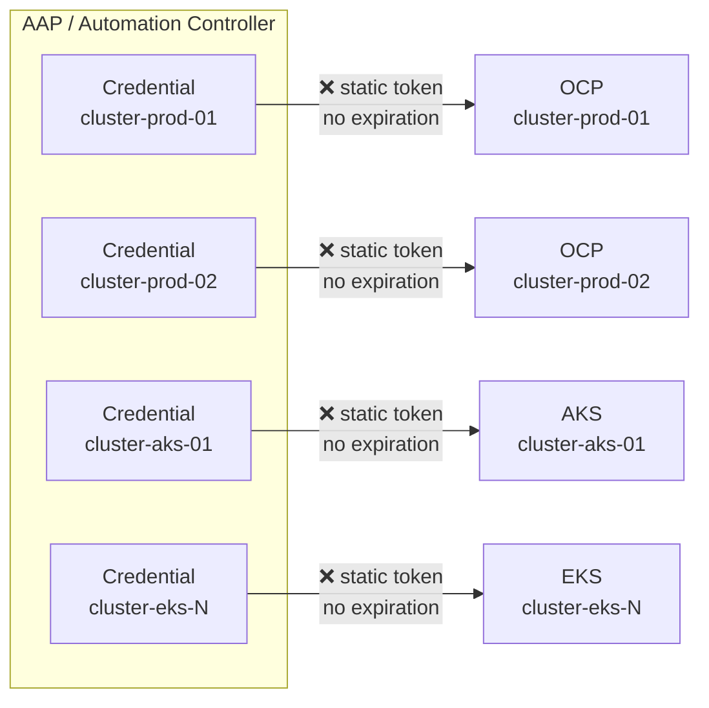
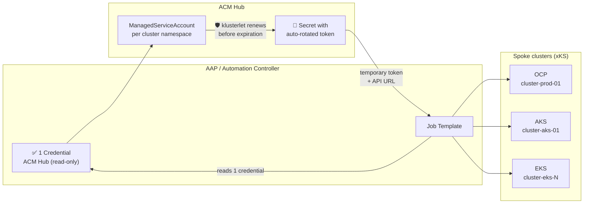
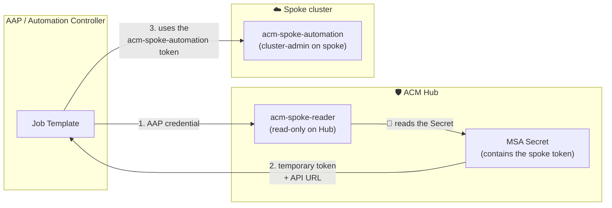
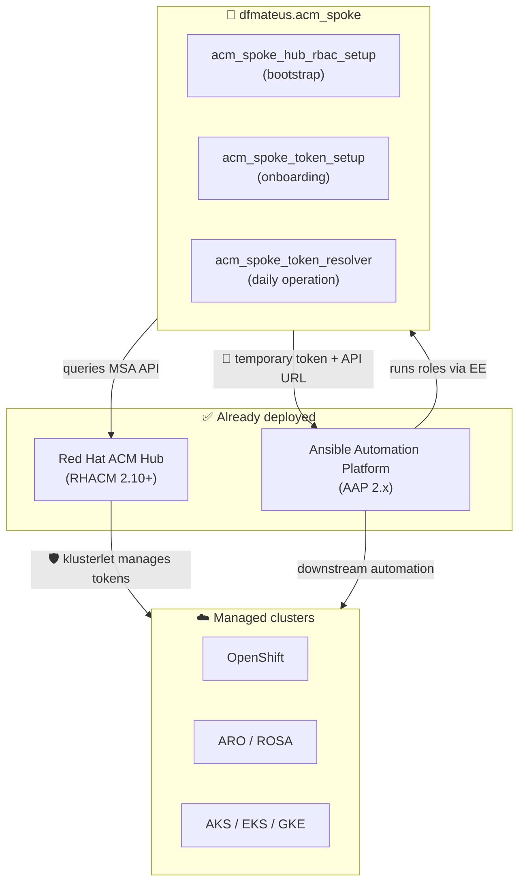

# 🔐 Centralized multi-cluster credential management with ACM and Ansible

## Executive summary

The `dfmateus.acm_spoke` collection replaces static per-cluster credentials with temporary, auto-rotated tokens resolved from a single read-only credential on the ACM Hub. Instead of maintaining N credentials for N clusters (each with a permanent token and no traceability), the automation queries the Hub on demand and receives a token with limited validity, automatically renewed by the klusterlet. Works with any Kubernetes distribution managed by RHACM: OpenShift, ARO, ROSA, AKS, EKS, GKE, IKS, and vanilla Kubernetes.

> 🛡️ **Key outcome:** N static credentials with permanent tokens -> **1 read-only credential** with auto-rotated temporary tokens. Onboarding from 15 min/cluster -> under 1 min. Manual rotation -> automatic. Per-cluster revocation -> centralized on the Hub.

---

## ❌ Current state: static per-cluster credentials

In the traditional approach, each automation that needs access to a spoke cluster maintains its own static credential. Each credential contains a ServiceAccount token that never expires.

This model creates risks that grow proportionally with fleet size:

- ❌ A leaked token grants permanent access to the entire cluster until someone discovers the leak and manually revokes the token on that specific cluster.
- ❌ Rotating N tokens across N clusters requires logging into each cluster individually, recreating the token, and updating the credential in AAP. In practice, most organizations never execute this process.
- ❌ Each new cluster requires 10 to 15 minutes of manual setup: login to the cluster, create a ServiceAccount, extract the token, register the credential in AAP.
- ❌ In multi-cloud fleets (OpenShift + AKS + EKS + GKE), each platform has different ServiceAccount semantics, API ports, and authentication flows. Maintaining credentials across all of them multiplies the operational cost.
- ❌ No centralized audit trail exists. Token creation, rotation, and revocation are manual processes with no record.

> ⚠️ **Critical risk:** In a fleet with 50 clusters, that means 50 permanent tokens with **`cluster-admin`**, 50 credentials in AAP, 50 attack surfaces. A single leaked token gives unrestricted access to the entire cluster, with no expiration, until someone discovers and manually revokes it.

---

## ✅ Proposed state: centralized token resolution

The collection turns the ACM Hub into a single point of credential management. One read-only credential on the Hub replaces all per-cluster credentials:

What changes in operations:

- ✅ One read-only credential on the Hub replaces all per-cluster credentials. Regardless of how many clusters exist, AAP registers a single credential.
- 🔄 Tokens have a configurable TTL (default: 30 days) and are automatically renewed by the klusterlet before expiration. No human intervention is needed for rotation.
- ⚡ New cluster onboarding is automated: the bootstrap auto-discovers all ManagedClusters and provisions those that are missing. Time per cluster: under 1 minute.
- 🛡️ Revocation is centralized: deleting the ManagedServiceAccount CR on the Hub causes the klusterlet to remove the ServiceAccount on the spoke automatically. No per-cluster login needed.

> ✅ **Differentiator:** The same fleet of 50 clusters now operates with **1 read-only credential**, tokens with 30-day validity that renew themselves, and revocation via a single command from the Hub.

---

## 📊 Quantified impact

| Metric | ❌ Static tokens (current) | ✅ With this collection |
|---|---|---|
| 🔑 Credentials per fleet | N (1 per cluster) | **1** (Hub read-only) |
| 🔧 Manual steps for new cluster | 5-7 steps, 10-15 min | **0** (auto-provisioned via bootstrap) |
| 🔄 Token rotation | Manual or never done | **Automatic** (klusterlet renews before TTL) |
| ⏱️ Time to revoke access to 1 cluster | 10-15 min (manual login + cleanup) | **< 1 min** (delete MSA on Hub) |
| 💥 Blast radius of leaked credential | Full cluster access, permanent | **Limited by TTL**, expires automatically |
| 📋 Audit trail | None | **Kubernetes API events** on the Hub |
| ☁️ Multi-cloud complexity | Different SA semantics per platform | **Identical flow** for all platforms |
| 🔎 Pre-execution validation | None (fails mid-execution) | **6 checks** before any interaction |

---

## 🛡️ Security posture improvement

### Access model: 3 layered SAs

The collection uses three ServiceAccounts in different layers, each scoped to the minimum required for its function:

| SA | Where it lives | Permissions | When it is used |
|---|---|---|---|
| 🔧 **`acm-spoke-provisioner`** | Hub | Write on Hub: create MSA, ManifestWork, enable addon | Setup (once per cluster). Can be removed from AAP after onboarding. |
| 🔎 **`acm-spoke-reader`** | Hub | Read-only on Hub: read 5 resource types. **Has no permissions on the spokes.** | Daily operation. This is the SA registered as a credential in AAP. |
| 🛡️ **`acm-spoke-automation`** | Spoke | **`cluster-admin`** on the spoke (configurable via the `acm_spoke_token_setup_spoke_cluster_role` variable). Created automatically by the klusterlet via MSA. | Temporary token with TTL, auto-rotated. This is the token that automation actually uses to operate on the spoke. |

The access chain works like this:

The central point: the **`acm-spoke-reader`** does not execute anything on the spoke. It is only the intermediary that reads the MSA Secret on the Hub. The SA with actual spoke permissions is **`acm-spoke-automation`**, a different SA created by the klusterlet. That SA's token is temporary (configurable TTL, default 30 days) and auto-rotated.

> 🔎 **Why is the reader read-only if the spoke token has cluster-admin?** Because they are two distinct SAs in two different clusters. The reader lives on the Hub and can only read. The `acm-spoke-automation` lives on the spoke and has the actual permissions. This separation ensures that: (1) the AAP credential cannot modify anything on the Hub or on the spokes directly, (2) the spoke token that the reader reads expires automatically by TTL, and (3) if the reader token leaks, the attacker cannot create new tokens or escalate privileges, only read spoke tokens that will expire on their own.

> 🛡️ **Least privilege on the spoke:** the `acm-spoke-automation` receives `cluster-admin` by default, but this is configurable. If the downstream automation only needs `view` or `edit`, change the `acm_spoke_token_setup_spoke_cluster_role` variable during onboarding. The ManifestWork applies whatever ClusterRole you define.

### 🔄 Automatic rotation eliminates stale tokens

The klusterlet continuously monitors the token TTL and renews before expiration. There is no expired-token window. There is no need for quarterly "rotation sprints." There is no manual rotation runbook. The process is continuous and transparent.

Token validity is configurable per cluster:

| TTL | Rotation | Recommended use |
|---|---|---|
| 🔒 `168h` (7 days) | Weekly | High-security environments |
| 🛡️ `720h` (30 days) | Monthly | Balance between security and operations **(default)** |
| 🔓 `2160h` (90 days) | Quarterly | Lower-risk environments |

### 🗑️ Centralized revocation

To revoke access to a specific cluster, delete the ManagedServiceAccount CR on the Hub. The klusterlet on the spoke detects the removal and automatically cleans up the ServiceAccount and token on the cluster. No login to the spoke is needed. No need to locate the ServiceAccount manually.

To revoke access to all clusters at once, invalidate the reader SA token on the Hub (delete and recreate the Secret). No per-cluster credentials need to be touched.

> ⚡ **Response speed:** In a security incident, revoking access to a cluster takes under 1 minute from the Hub. No spoke login, no ServiceAccount hunting, no credential updates in AAP.

### 🔎 Pre-execution validation

The collection runs 6 checks before any interaction with the spoke. Each failure produces a specific message with the problem, the affected target, and a diagnostic command:

| # | Check | If it fails |
|---|---|---|
| 🔎 1 | ManagedCluster exists on the Hub | "Cluster X is not managed by this Hub" |
| 🔎 2 | ManagedCluster is Available | "Cluster X is offline or the klusterlet is degraded" |
| 🔎 3 | managed-serviceaccount addon is enabled | "MSA addon not enabled, shows how to enable" |
| 🔎 4 | ManagedServiceAccount CR exists | "MSA CR not found, shows how to create" |
| 🔎 5 | MSA Secret exists (token reported) | "The klusterlet has not reported the token yet" |
| 🔎 6 | ManifestWork RBAC exists and is Applied | "RBAC not deployed, SA has no permissions on the spoke" |

> ❌ **Without this collection:** the automation connects to the spoke and hopes the credential works. If the token expired, the SA was deleted, or the RBAC changed, execution fails mid-process with a generic authentication message, without indicating the root cause.
>
> ✅ **With this collection:** the 6 checks detect the problem before any interaction, with an actionable message and a diagnostic command.

---

## 📋 Operational scenarios

### Scenario 1: New cluster joins the fleet

| | ❌ Without the collection | ✅ With the collection |
|---|---|---|
| Process | Login to the cluster, create ServiceAccount, extract token, register credential in AAP | Re-run the bootstrap. Auto-discovers new clusters and provisions only the missing ones |
| ⏱️ Time | 10-15 minutes per cluster | **Under 1 minute** per cluster |
| ⚠️ Error risk | High (manual process, depends on who executes it) | Low (idempotent, automated) |
| 🔒 TLS | Manual configuration per platform | Auto-detected via ManagedCluster `vendor` label |

### Scenario 2: Security incident requires immediate revocation

| | ❌ Without the collection | ✅ With the collection |
|---|---|---|
| Process | Identify affected clusters. Login to each one. Locate the SA. Delete token. Update credential in AAP. | Delete the ManagedServiceAccount CR on the Hub. The klusterlet removes the SA on the spoke automatically. |
| ⏱️ Time | Proportional to the number of clusters | **1 command per cluster**, all from the Hub |
| 💥 Residual risk | Old token remains valid until manual revocation | Token expires automatically by TTL even without action |

### Scenario 3: Quarterly compliance audit

| | ❌ Without the collection | ✅ With the collection |
|---|---|---|
| 📋 Credential inventory | No centralized record. Each cluster is a silo. | All ManagedServiceAccount CRs are on the Hub, with visible status and TTL. |
| 🔎 Traceability | No record of who created which token, when, or why. | MSA operations are Kubernetes API events on the Hub, auditable. |
| 🛡️ Least-privilege evidence | Requires manual RBAC inspection on each cluster. | The reader ClusterRole on the Hub has 5 explicit rules, documented in the RBAC manifest. |

---

## 🔗 Integration with existing investment

> ✅ **No new infrastructure required.** The collection connects two platforms already part of the environment: ACM Hub and AAP.

Requirements:

- 🔴 Red Hat Advanced Cluster Management (RHACM) 2.10+ on the Hub, with the managed-serviceaccount addon enabled.
- 🔴 Ansible Automation Platform (AAP) 2.x with Execution Environments.
- 🌐 Network connectivity between AAP and the Hub (port 6443) and between AAP and the spokes (port 6443 for OpenShift, 443 for AKS/EKS/GKE).
- 📦 The collection installs via `ansible-galaxy collection install dfmateus.acm_spoke`. No external dependencies beyond `kubernetes.core`.

---

## ☁️ Platform coverage

The collection works with any Kubernetes distribution imported as a ManagedCluster on the ACM Hub. The MSA API and ManifestWork are ACM primitives that operate through the klusterlet, with no dependency on OpenShift-specific APIs on the spoke.

| Platform | `vendor` label | Support |
|---|---|---|
| OpenShift Container Platform (OCP) | `OpenShift` | ✅ Full |
| Azure Red Hat OpenShift (ARO) | `OpenShift` | ✅ Full |
| ROSA / ROSA HCP | `OpenShift` | ✅ Full |
| Azure Kubernetes Service (AKS) | `Kubernetes` | ✅ Full |
| Amazon Elastic Kubernetes Service (EKS) | `Kubernetes` | ✅ Full |
| Google Kubernetes Engine (GKE) | `Kubernetes` | ✅ Full |
| IBM Kubernetes Service (IKS) | `Kubernetes` | ✅ Full |
| Vanilla Kubernetes | `Kubernetes` | ✅ Full (with active klusterlet) |

> 🔎 **TLS auto-detection:** TLS validation is auto-detected from the `vendor` label. `OpenShift` clusters use public certificates (`validate_certs: true`), `Kubernetes` clusters use internal CAs (`validate_certs: false`). No manual per-platform configuration needed.

---

## 📎 Next steps

For the technical team responsible for implementation:

| Document | Content |
|---|---|
| 📖 [Setup guide](setup-guide.md) | Prerequisites, SA creation, firewall rules, EE build |
| 🏗️ [Architecture](architecture.md) | Data flow, network diagram, port matrix |
| ▶️ [Usage examples](usage.md) | CLI and AAP execution, credential types, job templates, troubleshooting |
| 🧪 [E2E validation matrix](e2e-validation-matrix.md) | 16 tests on RHACM 2.12 with AKS, ARO Classic, and ARO HCP |
| 📋 [README](../README.md) | Variable reference, code examples, project structure |
